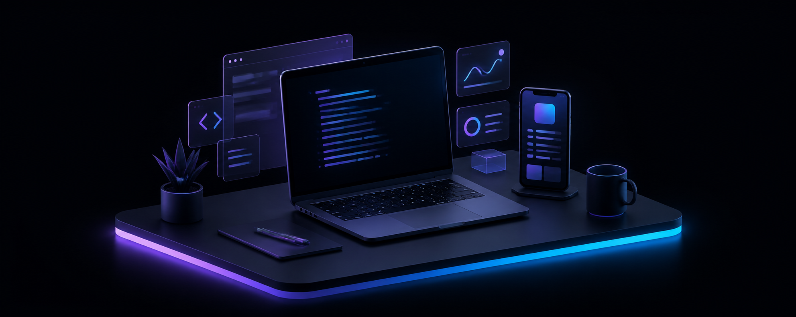

# Prateek Shukla

 

[Portfolio](https://pratxf.xyz) &nbsp;&nbsp; [LinkedIn](https://www.linkedin.com/in/meprat)

 

## Building Products That Ship

I am a Full Stack and Mobile Developer with 4+ years of experience turning ambitious product ideas into polished, reliable software. My work lives at the intersection of AI-powered SaaS, e-commerce, and mobile applications.

<table>
  <tr>
    <td width="33%" align="center"><strong>4+ years</strong> product development</td>
    <td width="33%" align="center"><strong>10+ platforms</strong> custom e-commerce delivered</td>
    <td width="33%" align="center"><strong>50+ clients</strong> freelance collaborations</td>
  </tr>
</table>

## Current Role

### Full Stack Developer | Aasman Digitals

`Remote | October 2025 - Present`

Building **UGCAds**, an AI-powered SaaS for UGC video generation, product photoshoots, and AI try-on workflows with subscription billing and admin management. Developed **Drazzel**, a full-stack e-commerce platform for India's premium dry-fruit market with 20+ admin pages, Shiprocket integration, and a sophisticated discount engine. Built **Izumi**, a Flutter enterprise workforce-management app with live GPS map dashboards, activity-aware polling, and offline sync.

I have also delivered 10+ custom e-commerce sites and integrated AI-assisted development workflows using Claude Code and OpenAI Codex.

## Featured Work

<table>
  <tr>
    <td width="50%" valign="top">
      <h3><a href="https://github.com/pratxf/UGCAds">UGCAds</a></h3>
      
AI-powered ad-content platform where brands create UGC videos up to 20 seconds with 100+ AI actors, product photos with 150+ scene templates, and virtual try-on models. Includes Supabase authentication, Cloudflare R2 storage, Razorpay billing, and Inngest job processing.

      Next.js | TypeScript | Supabase | OpenAI | Cloudflare R2 | Razorpay | Inngest
    </td>
    <td width="50%" valign="top">
      <h3><a href="https://drazzel-delta.vercel.app">Drazzel</a></h3>
      
Full-stack e-commerce platform for India's premium dry-fruit market with product variants, bundle packs, real-time cart, COD and Razorpay payments, loyalty rewards, 20+ admin pages, Shiprocket shipping, and a sophisticated discount engine.

      Next.js | TypeScript | Supabase | Shopflo | Shiprocket
    </td>
  </tr>
  <tr>
    <td width="50%" valign="top">
      <h3><a href="https://github.com/pratxf/Izumi">Izumi</a></h3>
      
Enterprise field-workforce management app with live GPS map dashboards, activity-aware polling that adapts to movement, geotagged photo capture, offline sync, crash recovery, and role-based access control.

      Flutter | Dart | Supabase | Google Maps
    </td>
    <td width="50%" valign="top">
      <h3><a href="https://kiwo-five.vercel.app">Kiwo</a></h3>
      
Premium learning platform for grades 1-6 with an adaptive AI tutor, six subject worlds, game-based lessons, personalized learning paths, streak and badge rewards, and a parental analytics dashboard.

      Next.js | TypeScript | Tailwind CSS | GSAP | Framer Motion
    </td>
  </tr>
</table>

### Mapcam

React Native geotagged photo-capture app with real-time GPS overlays, Google Maps API, role-based user and admin flows, and secure image storage on AWS S3 with an EC2 backend.

`React Native` `TypeScript` `Google Maps` `AWS S3` `EC2`

## Toolkit

  

  

 

<code>Framer Motion</code> &nbsp; <code>GSAP</code> &nbsp; <code>Lenis</code> &nbsp; <code>Zustand</code> &nbsp; <code>Zod</code> &nbsp; <code>shadcn/ui</code> &nbsp; <code>Radix UI</code> &nbsp; <code>Inngest</code> &nbsp; <code>Razorpay</code> &nbsp; <code>Cloudflare R2</code> &nbsp; <code>Shiprocket</code> &nbsp; <code>React Native</code> &nbsp; <code>Upstash</code> &nbsp; <code>Recharts</code> &nbsp; <code>FFmpeg</code>

---

  Currently building AI-powered products and high-conversion digital experiences.

